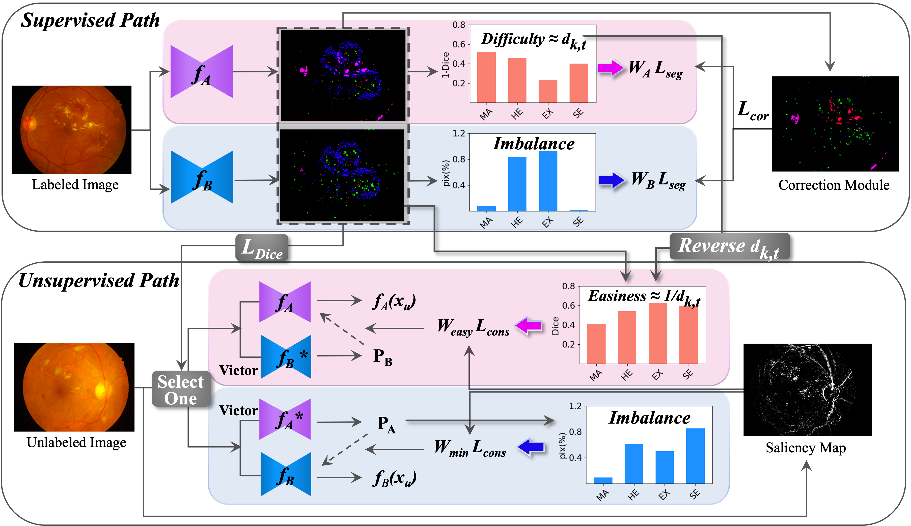

# RiCo: Semi-supervised Segmentation through Rival Networks Collaboration with Saliency Map in Diabetic Retinopathy


## Abstract
Automatic segmentation of diabetic retinopathy (DR) lesions in retinal images has a translational impact. However, collecting pixel-level annotations for supervised learning is labor-intensive. Thus, semi-supervised learning (SSL) methods tapping into the abundance of unlabeled images have been widely accepted. Still, a blind application of SSL is problematic due to the confirmation bias stemming from unreliable pseudo masks and class imbalance. To address these concerns, we propose a **Ri**val Networks **Co**llaboration with Saliency Map (**RiCo**) for multi-lesion segmentation in retinal images for DR. From two competing networks, we declare a victor network based on Dice coefficient onto which the defeated network is aligned when exploiting unlabeled images. Recognizing that this competition might overlook small lesions, we equip rival networks with distinct weight systems for imbalanced and underperforming classes. The victor network dynamically guides the defeated network by complementing its weaknesses and mimicking the victor’s strengths. This process fosters effective collaborative growth through meaningful knowledge exchange. Furthermore, we incorporate a saliency map, highlighting color-striking structures, into consistency loss to significantly enhance alignment in structural and critical areas for retinal images. This approach improves reliability and stability by minimizing the influence of unreliable areas of the pseudo mask. A comprehensive comparison with state-of-the-art SSL methods demonstrates our method’s superior performance on two datasets (IDRiD and e-ophtha). 

## Main Figure
  

## Keywords
Semi-supervised learning 	$\cdot$ Retinal image segmentation $\cdot$ Mutual learning

---------------------------------------

This repository is the implementation to review RiCo Network for IDRiD Dataset.

## 1. git clone
```
git clone https://github.com/eunjinkim97/SSL_DRlesion.git
```

## 2. Set the environment.
```
pip install -r requirements.txt
```

## 3. Dataset

### 3-1. Download the IDRiD Dataset in public.

### 3-2. Preprocess the IDRiD Dataset.
```
python RiCo/code/preprocess.py
```

### 3-3. Add prepared dataset path in configure file.
```
configs/data_module/train_ssl.yaml
configs/data_module/train_sup.yaml
```

## 4. Train models.

### 4-1. Train supervised models
c : gpu device id  
m : method  
t : seed tag  
s : sampling proportion  
Below commends are for 10% dataset and seed 43.   
```
PYTHONPATH='.' bash train_script.sh -c 0 -m sup_unet -t 43 -s 0.1
PYTHONPATH='.' bash train_script.sh -c 1 -m sup_unetplusplus -t 43 -s 0.1
``` 

### 4-2. Train semi-supervised models
```
PYTHONPATH='.' bash train_script.sh -c 0 -m ours -t 43 -s 0.1
PYTHONPATH='.' bash train_script.sh -c 1 -m dhc -t 43 -s 0.1
PYTHONPATH='.' bash train_script.sh -c 2 -m mcf -t 43 -s 0.1
PYTHONPATH='.' bash train_script.sh -c 2 -m cps -t 43 -s 0.1
PYTHONPATH='.' bash train_script.sh -c 3 -m cld -t 43 -s 0.1
PYTHONPATH='.' bash train_script.sh -c 3 -m uamt -t 43 -s 0.1
``` 


